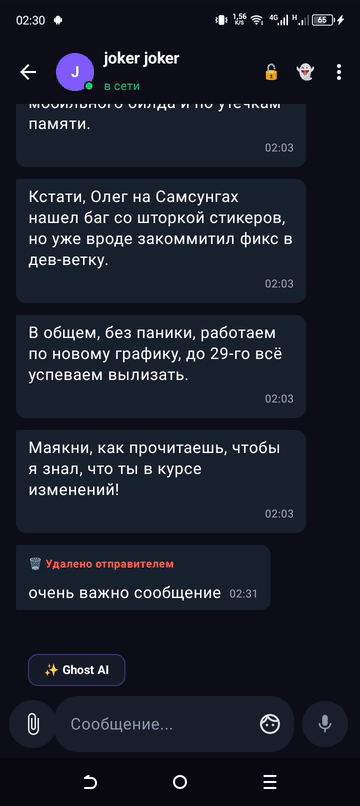
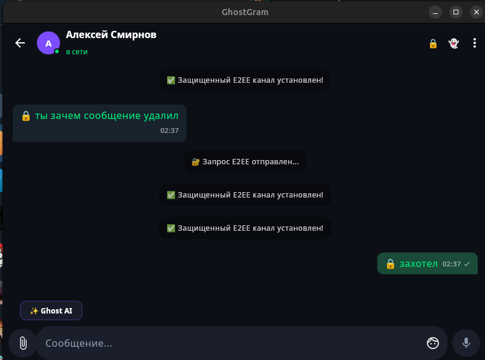
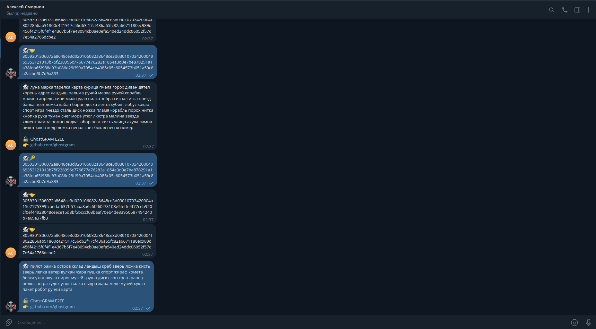
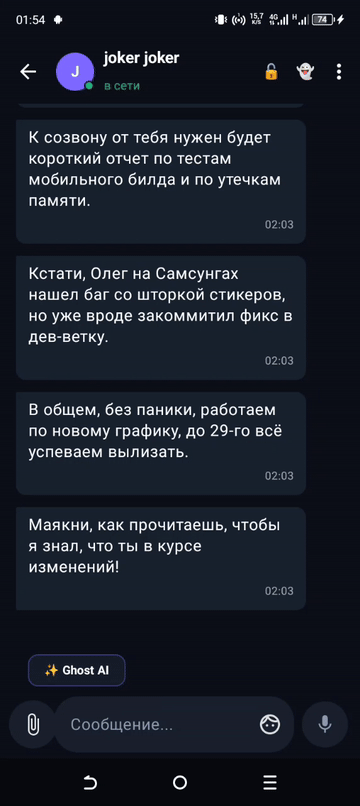
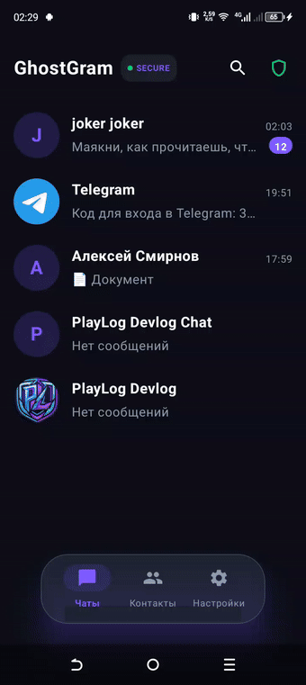
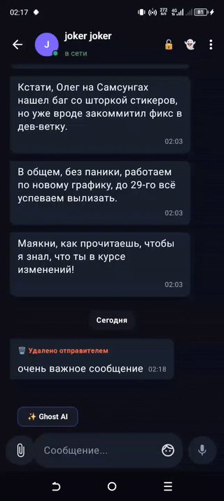

<p align="center">
  
</p>

<h1 align="center">GhostGRAM 👻</h1>

<p align="center">
  <strong>Next-Gen Experimental Telegram Client built with Compose Multiplatform & TDLib</strong><br>
  <em>Engineered for zero metadata leakage, client-side intelligence, and uncompromising local privacy.</em>
</p>

<p align="center">
  <a href="https://kotlinlang.org"></a>
  <a href="https://www.jetbrains.com/lp/compose-multiplatform/"></a>
  <a href="https://core.telegram.org/tdlib"></a>
  <a href="https://www.gnu.org/licenses/gpl-3.0"></a>
  
  
</p>

> ⚠️ **LEGAL DISCLAIMER:**  
> **GhostGRAM is an independent, unofficial open-source client application powered by the official Telegram Database Library (TDLib).**  
> It is **not** affiliated with, authorized, maintained, sponsored, or endorsed by Telegram FZ-LLC or any of its affiliates. All registered trademarks and intellectual properties belong to their respective owners.

<p align="center">
  <a href="#-key-features">Features</a> •
  <a href="#-comparison">Comparison</a> •
  <a href="#-architecture">Architecture</a> •
  <a href="#-cryptography--steganography">Security</a> •
  <a href="#-downloads">Downloads</a> •
  <a href="#-building-from-source">Build</a> •
  <a href="#-license">License</a>
</p>

---

## 💡 The Motivation

Official messaging clients increasingly prioritize corporate monetization, leaving users vulnerable to chat log deletion and spam-ridden search queries. **GhostGRAM** was developed as an experimental, independent power-user client to prove that modern declarative UI (**Compose Multiplatform**) combined with native C++ engines (**TDLib**) can solve fundamental UX & security flaws natively on user devices.

---

## ⚡ Highlights & Killer Features

### 🥷 E2EE Steganography (Ghost Shield)
Custom end-to-end encryption layer (ECDH P-256 + AES-GCM-256) encoding encrypted payloads into innocent natural Russian dictionary words (`WordCoder`) to avoid metadata leakage.

<p align="center">
  
</p>

| 📱 GhostGRAM (Decrypted View) | 💬 Official Telegram (Network / Server View) |
| :---: | :---: |
|  |  |
| *Recipient sees the decrypted message with a secure lock badge.* | *Any external observer or server only sees benign dictionary words.* |

### 🛡️ Smart Anti-Revoke
Deleted messages are never lost. They remain safely stored in your local Room KMP database and tagged with a visible `🗑️ Deleted` badge.

<p align="center">
  
</p>
* Includes **granular storage controls**: clean temporary cached media while preserving critical audit logs forever.

### 🧠 On-Device AI Assistant (BYOK)
Instant chat summarization (**Catch-Up**) and contextual smart replies powered by Google Gemini with private Bring-Your-Own-Key architecture.

<p align="center">
  
</p>

### 🔍 Clean Global Search (Client-Side Regex Engine)
Eliminates search pollution (SEO keyword stuffing, fraudulent crypto channels, spam bots) using deterministic regex filtering, presenting users with pure, legitimate channels and chats.

### 🎨 Fluid 120 FPS UI & Gestures
100% declarative UI in Compose Multiplatform with custom layout pixel measurements, swipe-to-reply physics, dynamic message bubble tails, and RAM-cached Lottie animated stickers.

<p align="center">
  
</p>

---

## 📊 Comparison: GhostGRAM vs. Official Telegram

| Feature | Official Telegram | Standard Forks | GhostGRAM 👻 |
| :--- | :---: | :---: | :---: |
| **Codebase Origin** | Legacy Java/C++ | Patched Official Code | **100% Clean KMP Scratch** |
| **Cross-Platform Tech** | Separate Apps (Android / Qt) | Android-only | **Unified Compose Multiplatform** |
| **Anti-Revoke Audit** | ❌ Wiped | ⚠️ Hacky | **✅ Native Room KMP Engine** |
| **Steganographic E2EE** | ❌ (Raw MTProto) | ❌ | **✅ ECDH + WordCoder Encoding** |
| **AI Summarization** | ❌ (Paid Bots) | ❌ | **✅ Built-in Gemini (BYOK)** |
| **Search Spam Filter** | ❌ Vulnerable to SEO | ❌ | **✅ Client-Side Regex Blocker** |
| **Separated Storage Cache** | ❌ Deletes All | ❌ | **✅ Media vs. Revoked Messages** |

---

## 🏗️ Architecture & Modules

GhostGRAM follows strict **Clean Architecture** with unidirectional data flow (**MVI**):

```text
┌────────────────────────────────────────────────────────┐
│             :composeApp (Presentation Layer)           │
│       Compose Multiplatform · MVI · Custom Layouts     │
└──────────────────────────┬─────────────────────────────┘
                           │ Intents & UI State
┌──────────────────────────▼─────────────────────────────┐
│                     :domain Layer                      │
│        Entities · UseCases · Repository Contracts      │
│                     :core:crypto                       │
│        ECDH P-256 · AES-256-GCM · WordCoder Stego      │
└──────────────────────────┬─────────────────────────────┘
                           │ Repositories & Data Sources
┌──────────────────────────▼─────────────────────────────┐
│                      :data Layer                       │
│   :core:database (Room KMP) · :core:tdlib (C++ JNI)    │
│              :core:network (Ktor Client)               │
└────────────────────────────────────────────────────────┘

    UI Engine: Compose Multiplatform (Desktop JVM & Android)

    Core Engine: Native TDLib 1.8.x via JNA/JNI

    Database: Room KMP (SQLite) with reactive Flows

    DI Framework: Koin

    Networking: Ktor Client + Google Gemini API

    Media Pipelines: Coil 3, Compottie, FileKit, Okio

📥 Downloads & Verification

Pre-compiled public preview packages are cryptographically signed and available under GitHub Releases:
Platform	Package	Verification	Status
Android (8.0+)	GhostGRAM-v0.1.0-alpha.apk	VirusTotal Report	🟢 Clean
Linux (Debian/Ubuntu)	GhostGRAM_0.1.0_amd64.deb	VirusTotal Report	🟢 Clean

Integrity Checksums (SHA-256) are listed in every official release note.
🛠️ Building from Source
Prerequisites

    JDK 17 or higher

    Android SDK & NDK installed

    Linux (Debian-based) or macOS/Windows for Desktop builds

code Bash

# 1. Clone repository
git clone https://github.com/ваш_логин/GhostGram.git
cd GhostGram

# 2. Configure credentials
cp local.properties.example local.properties
# Provide your TG_API_ID and TG_API_HASH from my.telegram.org

# 3. Build Android Release APK
./gradlew :androidApp:assembleRelease

# 4. Build Linux Desktop Package
./gradlew :desktopApp:packageReleaseDeb

📄 License

This project is licensed under the GNU General Public License v3.0 (GPL-3.0).
See the LICENSE file for details.
